# PokeAventura

# Manual de usuario - Usuario básico

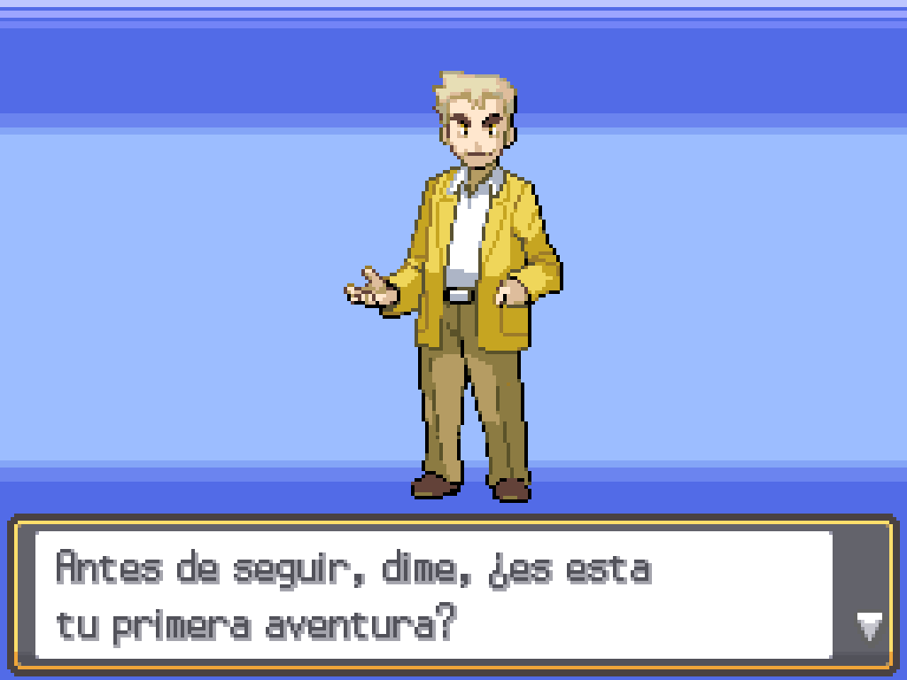

**¡Bienvenido! ¿Es esta tu primera aventura?**

Quizás hayas escuchado esta frase muchas veces a lo largo de tu vida, o quizás esta sea la primera vez. De cualquier forma, ¡estoy aquí para guiarte en tu nueva PokeAventura!

## Inicio

La primera vez que entres en el juego, verás esta pantalla.

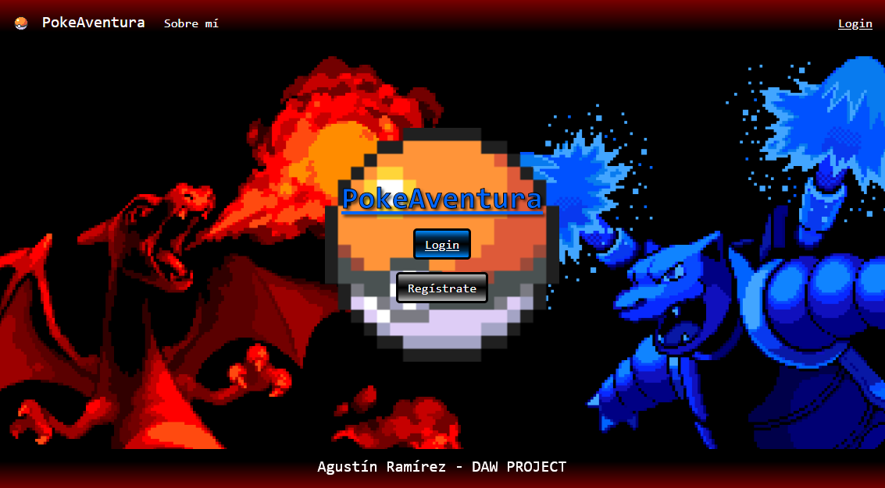

Aquí, la elección es fácil: Si ya tienes una cuenta, sólo tienes que pulsar el botón de **Login**. Si por el contrario, aún no te has registrado y no tienes credenciales de usuario, ¡no te preocupes!

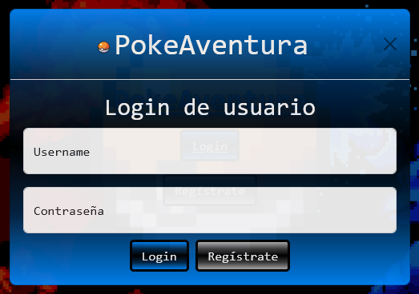

En la página principal tanto como en el menú de **login** encontrarás un botón que te permite acceder al registro de una cuenta.

## Registro - Parte 1

Al pulsar el botón de registro, verás esta pantalla. En ella, podrás introducir los datos para el registro de tu nueva cuenta de usuario. Tendrás que introducir los siguientes datos:
- Correo electrónico: Debe ser un correo válido.
- Nombre de usuario: No puede contener espacios y debe ser único (¡Podrías encontrarte con que tu nombre de usuario ya está en uso por otra persona!).
- Contraseña: Debe de tener 4 caracteres o más.

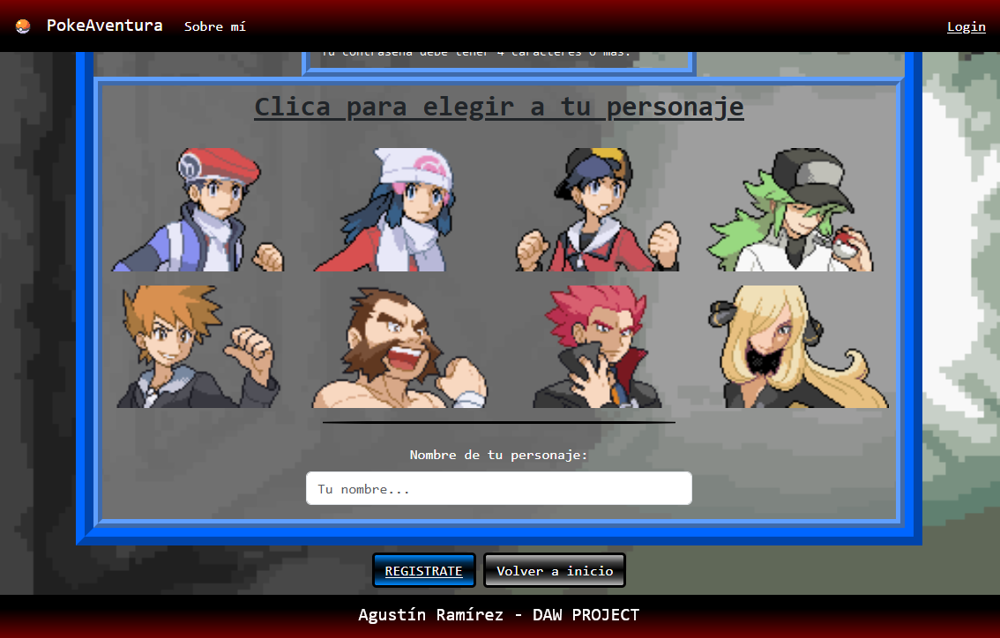

En la parte inferior del registro, podrás ver una selección de personaje. ¡Clica en el que más te guste o el que te represente! Una vez seleccionado, verás que está rodeado por un borde, indicando que es tu elección. Debajo, podrás ver un campo donde introducir el nombre de tu personaje. Puede ser el que quieras, pero no puede estar en blanco.

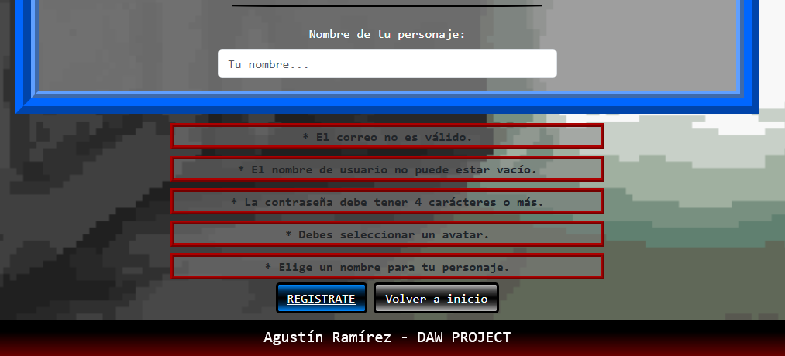

- Si tienes errores en el formulario de registro, ¡no te preocupes! Se te indicará con mensajes de error donde tienes el fallo.

## Registro - Parte 2

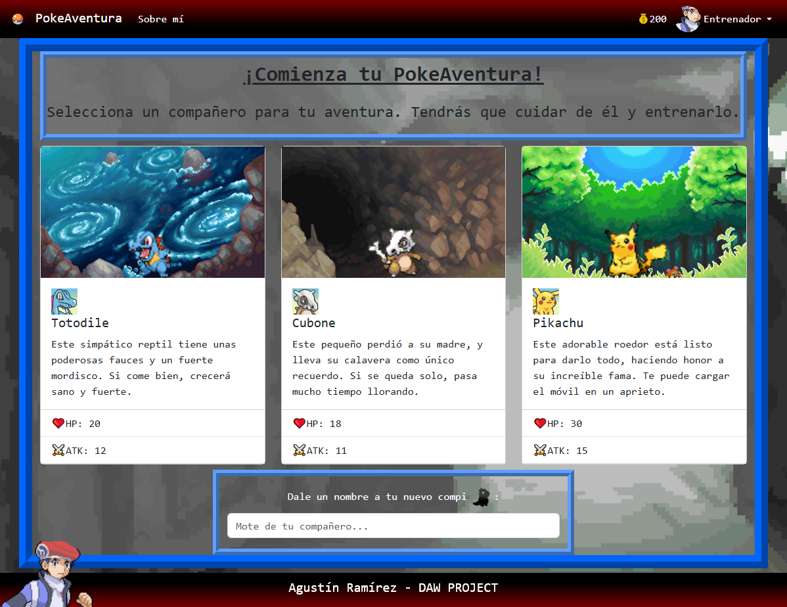

Una vez introduces tus credenciales después de haberte registrado, la primera vez que accedas a la aplicación se te presentará la decisión más importante de tu aventura: ¡quién te acompañará en ella! Elige bien, ¡ya que es una decisión permanente! De la misma forma que seleccionaste a tu personaje anteriormente, aquí igual: clica sobre el compañero que más te guste, dale un nombre, ¡y a la aventura!

## Menú del juego

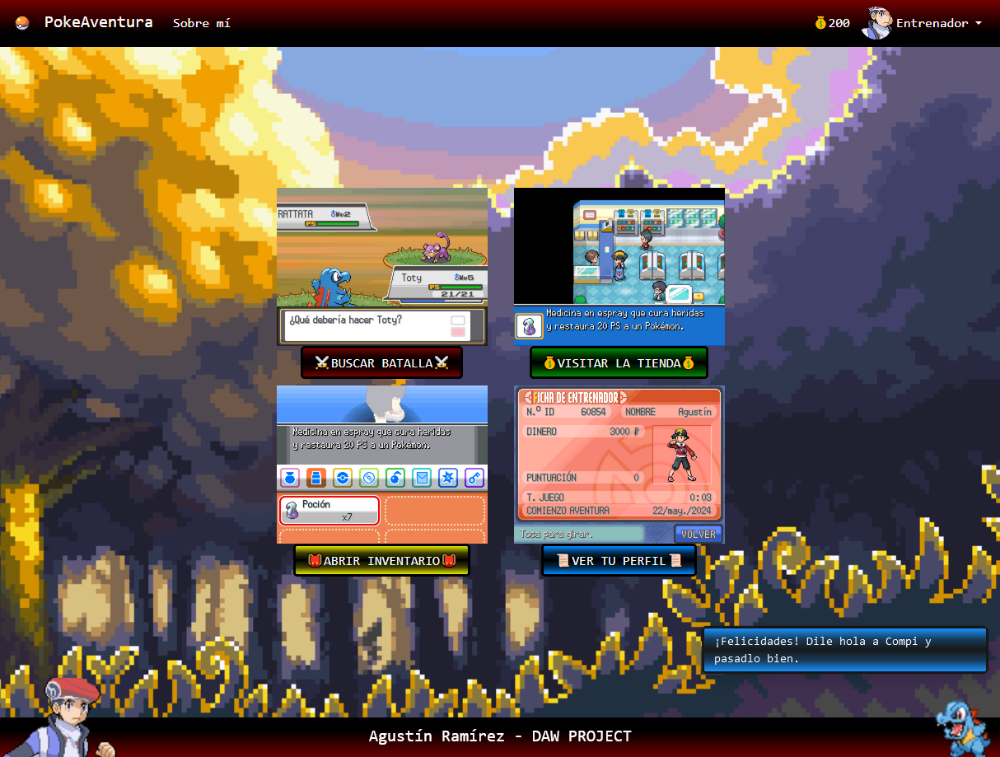

Como puedes ver, recibirás una notificación y podrás ver a tu compi y a tu personaje en la barra inferior de la pantalla. Aquí se te presentan 4 opciones, las cuales vamos a ver a continuación en detalle. Para acceder a alguno de los apartados, no tienes más que hacer clic sobre el botón o la imagen correspondiente.

### Batalla

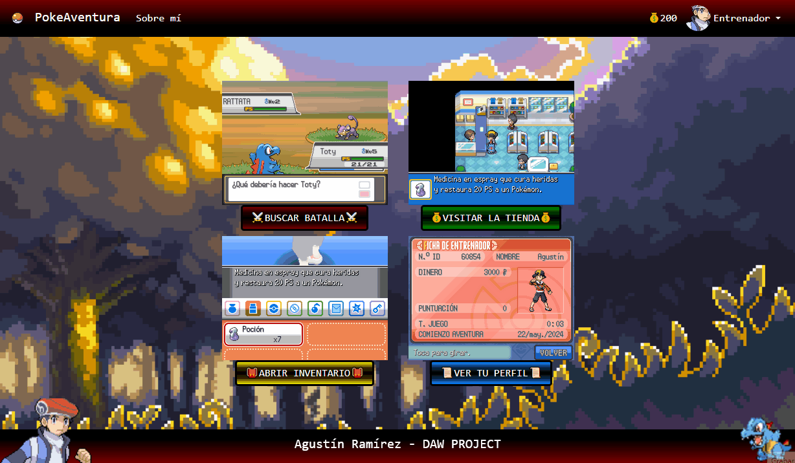

Si clicas en el botón de buscar batalla, iniciarás un combate contra un enemigo seleccionado al azar de la siguiente tabla:

| Nombre   | Nivel | Ratio aparición |
|----------|-------|-----------------|
| Rattata  | 1     | 25%             |
| Snorunt  | 2     | 25%             |
| Ursaring | 3     | 20%             |
| Snorlax  | 4     | 15%             |
| Sharpedo | 4     | 10%             |
| Chansey  | 5     | 5%              |

Puedes atacar al enemigo pulsando el boton de Atacar. Si derrotas al enemigo, ¡recibirás experiencia y dinero! Pero ten cuidado, ¡el enemigo también atacará a tu compañero, haciéndole daño!

Como puedes observar, las barras verdes de salud indican la cantidad de puntos de vida que tienen ambos combatientes, y debajo de tu compi, aparece una barra de experiencia. Derrota suficientes enemigos para llenarla, ¡y tu compi subirá de nivel!

### Tienda

Muy bien, pero... ¿Qué pasa si dañan mucho a tu compi? Habrá que atender sus heridas. Si te diriges a la tienda, podrás ver la selección de objetos que Eusine, el dueño de la tienda, tiene a la venta.

Usando el dinero que ganas derrotando enemigos, puedes comprar pociones para curar a tu compañero. Cada una tiene un coste y efecto diferentes, así que piensa bien qué vas a comprar.

### Objetos

Si en algún momento del combate, tu compi está herido y necesita una cura, no dudes en clicar el botón de Inventario. Éste mostrará tu mochila, la cual contiene todos los objetos que lleves encima, guardados para que los uses cuando sea necesarios. También puedes usar los objetos de tu mochila pulsando en el botón o la imagen correspondientes en el menú del juego.

### Perfil

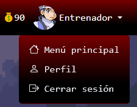

En cualquier momento, puedes acceder a tu ventana de información sobre tu perfil, incluyendo todos tus datos y los de tu compi. Puedes clicar sobre la foto o su botón del menú, o bien, clicando en tu nombre e imagen en la esquina superior derecha, y clicando en Perfil.

## Experiencia y Niveles

Podrás haberte fijado en que, al combatir y ganar, recibes puntos de experiencia. Estos puntos, al rellenar la barra por completo, harán que tu compi suba de nivel.

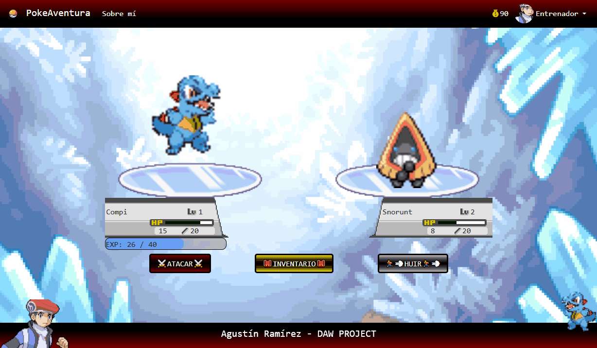

Cuando esto suceda, ¡tu compi se hará más fuerte! Depende de qué raza sea, ganará más o menos puntos de salud máximos y puntos de ataque adicionales.

## Evolución

Si sigues entrenando a tu compi con diligencia, y las condiciones óptimas se alinean...

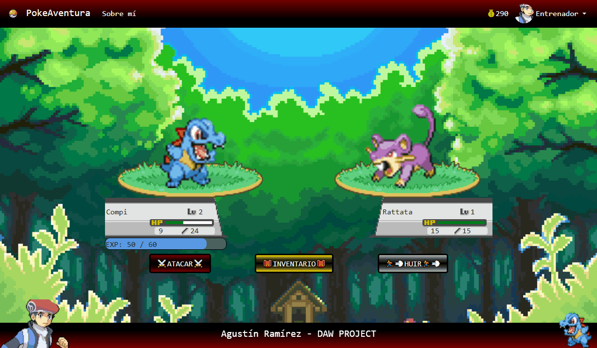

Al alcanzar ciertos niveles, ¡algunos compis pueden evolucionar! Aquí te dejo una tabla con los niveles que cada compi necesita alcanzar para evolucionar.

| Nombre   | Nivel | Evolución  |
|----------|:-----:|------------|
| Totodile |   3   | Croconaw   |
| Croconaw |   5   | Feraligatr |
| Cubone   |   3   | Marowak    |

No tengas miedo en que esto pase. ¡Todas sus estadísticas aumentarán bastante, y además, crecerán a un ritmo más alto!

## Sobre mí

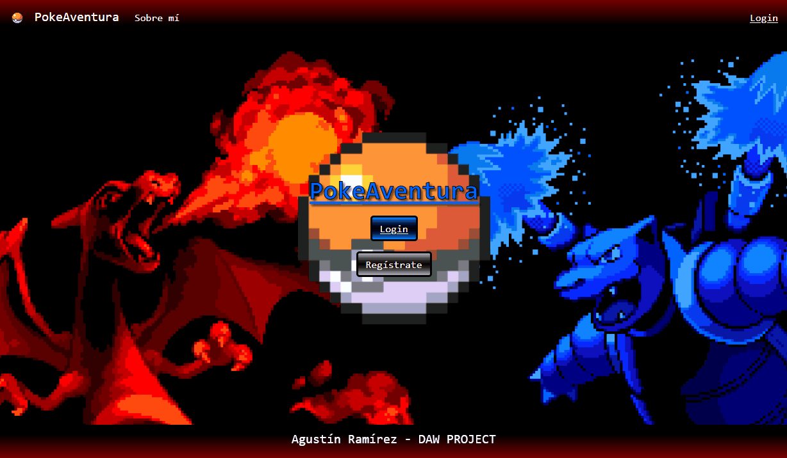

En cualquier momento, puedes pulsar sobre las palabras `Sobre mí` para ver un menú desplegable con informacion sobre el autor de la aplicación. Ha desarrollado este juego con mucho cariño y dedicación, ¡así podrás saber quién se esconde detrás del telón!

***

# Admin

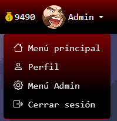

Aparte de todas las funcionalidades mencionadas en el manual de usuario hasta ahora, puede que seas un usuario administrador asignado por el autor de la aplicación. Si es así, y clicas sobre la cara de tu personaje o su nombre, en el menú desplegable podrás ver una nueva función que solo aparece para los usuarios con rol de administrador: el Menú Admin.

En este menú, tienes botones con funciones debug, como añadir y restar cantidades de dinero a la cuenta, y una cura total con fines de testeo.

# Fin

Eso es todo lo que tengo que enseñarte. El resto, ¡deberás descubrirlo tú mismo jugando! ¡Espero que disfrutes mucho del tiempo que pases junto a tu nuevo compi!