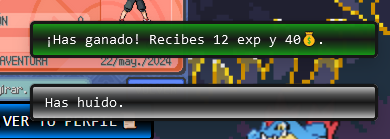

# PokeAventura


### Ciclo formativo de Grado Superior de Desarrollo de Aplicaciones Web (DAW)
### I.E.S. Suárez de Figueroa


### Autor del proyecto: Agustín Ramírez Figueredo
### Tutor del proyecto: Juan Morales González
### Junio de 2024
### Repositorio del proyecto: [Github PokeAventura](https://github.com/AgustinRF22/pokeaventura_defensa)

## Índice

1. [Introducción del proyecto](#1-introducción)
2. [Objetivos del proyecto](#2-objetivos-del-proyecto)
3. [Justificación del proyecto](#3-justificación-del-proyecto)
    - [Análisis de mercado](#análisis-de-mercado)
        - [Vinculación de contenidos vistos en el ciclo formativo](#vinculación-de-contenidos-vistos-en-el-ciclo-formativo)
    - [Recursos Utilizados](#recursos-utilizados)
        - [Entornos de desarrollo](#entornos-de-desarrollo)
        - [Lenguajes de programación](#lenguajes-de-programación)
    - [Utilidades](#utilidades)
4. [Tecnologías de Desarrollo](#4-tecnologías-de-desarrollo)
5. [Diseño del proyecto](#5-diseño-del-proyecto)
    - [Diseño de la base de datos](#diseño-de-la-base-de-datos)
    - [Carga de datos inicial](#carga-de-datos-inicial)
    - [Diseño de la inferfaz de usuario](#diseño-de-la-interfaz-de-usuario)
    - [Roles de la aplicación](#roles-de-la-aplicación)
    - [Usuarios creados para pruebas](#usuarios-creados-para-pruebas)
6. [Lógica/codificación del proyecto](#6-lógicacodificación-del-proyecto)
    - [Principales procesos](#principales-procesos)
    - [Aspectos relevantes de la implementación](#aspectos-relevantes-de-la-implementación)
7. [Despliegue Web del proyecto](#7-despliegue-web-del-proyecto)
8. [Manual de usuario](#8-manual-de-usuario)
9. [Conclusiones y aspectos a mejorar](#9-conclusiones-y-aspectos-a-mejorar)
    - [Conclusiones](#conclusiones)
    - [Aspectos a mejorar](#aspectos-a-mejorar)
10. [Bibliografía](#10-bibliografía)

## 1. Introducción

En este archivo se explica al detalle la aplicación web `PokeAventura`, el proyecto TFG del alumno Agustín Ramírez Figueredo de DAW 2023/2024 del I.E.S. Suárez de Figueroa. En él veremos todos los detalles, pudiendo ir a determinados apartados mediante el índice superior.

## 2. Objetivos del proyecto

Los objetivos del proyecto son los siguientes:

- Desarrollar una aplicación web que permita acceder a un juego web basado en la franquicia de `Pokémon`.

- Todas las páginas de la aplicación serán mostradas dinámicamente en `index.html`, siendo la única página web disponible de acceso.

- Un usuario puede acceder a la página principal `avhome` del juego, donde se le presentarán los botones de Iniciar sesión (Login) y el de Registrarse.

    - Si un usuario ya tiene datos de login en la sesión, se iniciará sesión directamente sin que el usuario tenga que hacer nada, siendo redireccionado al menú del juego. Si no se tienen datos de inicio de sesión, se le mantiene en la página `avhome`.

- Si un usuario elige registrarse, se le presentará un formulario donde tendrá que introducir sus datos y elegir a su personaje.

- Cuando un usuario que ya tiene credenciales en la base de datos hace login, si es su primera vez, se le presenta otro formulario de elección de compañero. Esto será así hasta que finalice la selección de compañero. Si el usuario tiene datos de compañero, este formulario no se mostrará, y accederá al juego.

    - Cuando se ha hecho login, independientemente de si tiene compañero o no, aparece un menú desplegable en la barra de navegación, permitiendo cerrar sesión y otras opciones con disponibilidad variable.

- Dentro del juego, se podrá buscar batalla, visitar la tienda, abrir el inventario (también se puede en plena batalla) y ver tu perfil.

    - La batalla consiste en hacer que tu compañero luche contra un enemigo.
    - La tienda permite al usuario usar su dinero que gana a medida que juega para comprar objetos que se almacenarán en su inventario personal.
    - El inventario contiene los objetos que posee el usuario, permitiendo su uso.
    - El perfil muestra una pantalla con información detallada del usuario y del compañero, con todos los datos pertinentes.

- Se ha desarrollado un sistema de notificaciones para avisos al usuario de parte del programa.

- En la barra de navegación hay, en todo momento, un apartado llamado `Sobre mí`, que si se pulsa, muestra una pequeña ventana de información del autor.

## 3. Justificación del proyecto

### Análisis de mercado

Desde su creación en 1996, la franquicia de Pokémon ha mantenido una popularidad constante y en alto crecimiento, con más de 380 millones de juegos vendidos y más de 1000 episodios en su serie animada. Debido al amplio interés en la franquicia, se espera un extenso éxito gracias a su popularidad y su naturaleza sencilla pero adictiva.

#### Vinculación de contenidos vistos en el ciclo formativo

- Lenguajes de programación: 

    - Backend: PHP, SQL.
    - Frontend: HTML, CSS, JavaScript.
    - Librerías y Frameworks: JQuery, AJAX, Bootstrap.

- Gestión de Bases de Datos:

    - Diseño de Base de Datos: Diseño base de datos, Modelo ER, estructura de tablas y relaciones.
    - Sentencias SQL: sistema CRUD (Create, Read, Update, Delete) de sentencias SQL.

### Recursos utilizados

#### Entornos de desarrollo

- Visual Studio Code como editor de código. Gratuito y de código abierto, disponible tanto para Windows como para MacOS y Linux.

- phpmyadmin como interfaz web para acceso y administración de la base de datos MySQL.

#### Lenguajes de programación

- HTML y CSS: estructuración y diseño web estático de la aplicación web.
- JavaScript: aplicar dinamismo a la aplicación y funcionalidad de esta.
- PHP: Conexiones con la base de datos para operaciones CRUD en la misma.

### Utilidades

- [paint.net](https://www.getpaint.net) para edición de imágenes.
- [Pokencyclopedia](https://www.pokencyclopedia.info) para obtención de recursos de imágenes.
- [TheSpritersResource](https://www.spriters-resource.com) para obtención de recursos de imágenes.
- [PokéSprite](https://msikma.github.io/pokesprite) para obtención de recursos de imágenes.
- [Bulbapedia](https://bulbapedia.bulbagarden.net) para obtención de recursos de imágenes.
- [Emojipedia](https://emojipedia.org) para obtención de carácteres emoji.
- [CSS Gradient](https://cssgradient.io/) para generación de gradientes CSS.
- [ChatGPT](https://chatgpt.com) para consultas y resolución de dudas.

## 4. Tecnologías de desarrollo

Las tecnologías utilizadas para el desarrollo del proyecto han sido:

- Frontend: HTML, CSS, JavaScript, Bootstrap.
- Backend: PHP.
- Base de datos: MySQL.

## 5. Diseño del proyecto

### Diseño de la base de datos

- Diseño inicial de la base de datos, diagrama de entidad relación:


A medida que el proyecto avanzó, hubo algunos cambios de campos y ediciones, reflejadas en el modelo relacional final.

- Modelo relacional:


### Carga de datos inicial

Los datos de carga inicial se encuentran en un fichero de exportación con los mismos, alojado en `mysql/pokeaventura.sql`. Contiene los datos de todos los enemigos, de todos los starters y todos los objetos, así como la cuenta de admin ya creada y con su compañero asignado.

### Diseño de la interfaz de usuario

El diseño de la interfaz de usuario de esta aplicación web, al tratarse de un juego, es muy estilizado. Ha sido cuidado con detalle y desarrollado de forma que sea consistente, a la vez que intuitivo. Se usan colores que indiquen el tono de la naturaleza del elemento al que acompañan. Los botones, las notificaciones y los menús tienen juegos de colores acorde a lo que significan.


Home


Menú de juego


Perfil


Batalla



Notificaciones


Tienda


### Roles de la aplicación

Existen dos roles de usuario en la aplicación.

- Usuario: El rol más común, todo usuario que se cree una cuenta tendrá una cuenta con el rol de usuario, el cual permite el acceso al juego de manera normal, pudiendo elegir tu personaje y su compañero en el momento del registro y primer acceso a la aplicación, así como permitiendo que participe en batallas, luche y gane experiencia y dinero, visitar la tienda, comprar objetos, revisar el inventario propio del usuario, utilizar los objetos que se tengan en pertenencia, y revisar los datos del usuario, su personaje y su compañero.

- Admin: Las cuentas con este rol tienen acceso exclusivo a un menú de administrador especial, que contiene botones con funciones enfocadas a pruebas y testing de las funcionalidades de la aplicación. De manera normal, un usuario al registrarse no será admin nunca. Los roles de admin se asignan directamente en base de datos.

### Usuarios creados para pruebas

Debido al extenso número de funcionalidades de la aplicación y a que algunas solo suceden una o dos veces por cuenta (como el fenómeno de la evolución, explicado con más detalle en [Principales procesos](#principales-procesos)), se han creado varios usuarios de pruebas.

- Username: `aaaa` Password: `aaaa`
- Username: `bbbb` Password: `bbbb`
- Username: `cccc` Password: `cccc`
- Username: `1111` Password: `1111`
- Username: `2222` Password: `2222`

## 6. Lógica/codificación del proyecto

### Principales procesos

- **Registro**: Si no se tienen datos para iniciar sesión, se puede pasar por el formulario de registro para crear cuenta. Todos los campos son obligatorios, incluido por supuesto la selección de un personaje.

- **Login**: Si se tienen datos de cuenta al haber completado el registro, se puede acceder al juego. Hay dos rutas a seguir:
    - Si no se tiene un compañero: La única opción para el usuario que entra en la aplicación y no tiene un compañero es rellenar el registro de selección de compañero.
    - Si se tiene un compañero: Se accede con normalidad al menú del juego.

- **Menú desplegable**: menú dinámico desplegable al clicar sobre la cara de tu personaje y su nombre, en la barra de navegación a la derecha. Este menú siempre tendrá una opción para cerrar sesión, si se tienen datos de registro aparece la opción para ir al menú principal y otro para ir a la vista del perfil, y si se es de rol `admin` aparece la opción para entrar al menú de admin especial.

- **Batalla**: La batalla es el componente principal del juego y sobre lo que todo está basado. En el menú del juego, se puede acceder a buscar una batalla con el botón correspondiente, lo que inicia un combate con un enemigo al azar de la base de datos, siguiendo unos porcentajes específicos.
    - El botón de atacar dentro de batalla, hace que tu compañero se lance al ataque, haciendo tanto daño al enemigo como ataque tenga tu compañero. Si el enemigo no es derrotado, este lanzará un contraataque, inflingiendo tanto daño a tu compañero como ataque tenga el enemigo.
    - Si el enemigo es derrotado, el compi gana puntos de experiencia y el personaje gana dinero. Si el compi es derrotado, el personaje huirá para salvar a su compi, el cual quedará con 1 solo punto de vida.
    - Si se sube de nivel, al alcanzar suficientes puntos de experiencia, las estadísticas del compi aumentarán, recibiendo una subida a sus puntos de salud máximos (y actuales) y a su ataque.
        - Si el compi pudiese evolucionar y se alcanza el nivel específico para ello, el compi evoluciona. Su raza cambia, por lo que el nombre de raza y su aspecto también. Sus estadísticas serán recalculadas con las estadísticas base de la nueva raza y sus consecuentes subidas gracias a los niveles alcanzados.

- **Sistema de objetos**: Cuando se entra al juego, se cargan en el inventario del usuario los objetos que tenga en su posesión. Si no se tienen, la bolsa aparece vacía.
    - En la tienda, un usuario puede gastar el dinero que consigue jugando para comprar objetos curativos con los que mantener sano a su compi. Los objetos se pueden usar en batalla (viendo su efecto en plena batalla) o en el menú, pudiendo curar al compañero antes de entrar en combate.
    - Si el número de objetos que se tienen son consumidos por completo y se tienen 0, no aparecerán en la bolsa.

- **Sistema de notificaciones**: Se ha implementado un sistema de notificaciones, con su origen en la esquina inferior derecha de la aplicación, que se utiliza para informar al usuario de todo tipo de detalles, como fallos en registro, notificaciones de evolución, resultados de combate...

### Aspectos relevantes de la implementación

- La aplicación es inaccesible para usuarios que no dispongan de credenciales. Las diferentes páginas de la aplicación redireccionan al usuario a home hasta que tenga credenciales introducidas, solo permitiendo acceso al menú de login y al de registro.

- Se validan todos los datos de los formularios de registro.
    - El correo debe ser válido y no estar vacío
    - El nombre de usuario no puede estar vacío, y además, debe ser único en la base de datos.
    - La contraseña debe tener 4 caracteres mínimo.
    - Se debe haber clicado en uno de los avatares para seleccionarlo como elegido.
    - El nombre del personaje no puede estar vacío.
    - Así mismo, en el registro de selección de compi, se comprobará que hay uno de los 3 compis a elegir seleccionado y que el nombre que se le está poniendo no esté vacío.

- Al iniciar sesión, se guardan datos pertinentes del usuario en la aplicación. La sesión no se pierde al cerrar el navegador ni al recargar página.

**Sistema de carpetas**
```
pokeaventura_defensa
├───app
│   ├───css
│   ├───html
│   ├───img
│   ├───js
│   ├───node_modules
│   └───php
├───docker
│   ├───nginx
│   │   ├───config
│   │   └───snippets
│   └───php
├───documentacion
│   └───img
│       └───img_manual
└───mysql
```

- `app`: Contiene todos los archivos de la aplicación web.
    - `css`: Contiene los archivos de estilo.
    - `html`: Contiene los archivos html que se cargan en `index.html`.
    - `img`: Contiene las imagenes utilizadas por la aplicacion.
    - `js`: Contiene los archivos javascript.
    - `node_modules`: Carpeta con Bootstrap.
    - `php`: Contiene los archivos de php.
- `docker`: Contiene los archivos de configuración necesarios para el despliegue de la aplicación en un contenedor docker.
    - `nginx`: Archivos de configuración para el funcionamiento del servicio web.
    - `php`: Archivo de creación para el servicio php.
- `documentacion`: Contiene los archivos de la documentación del proyecto, así como las imágenes utilizadas en el mismo.
    - `img`: Carpeta para almacenar las imagenes de la documentación.
        - `img_manual`: Contiene las imagenes del manual de usuario.
- `mysql`: Almacena el archivo de base de datos.

## 7. Despliegue Web del proyecto

El despliegue de esta aplicación web se ha realizado en Digital Ocean, creando un droplet de Docker y desplegando sobre este.

El entorno docker utiliza `nginx`, `mysql` y `phpmyadmin`.


Fichero `docker-compose.yml`.


Fichero `default.conf` de `nginx`.


Droplet en Digital Ocean.

Mediante la conexión con clave SSH, podemos clonar nuestro repositorio en el droplet y desplegarlo mediante el comando `docker compose up`.

## 8. Manual de usuario

[Manual de usuario](./manual_usuario.md)

## 9. Conclusiones y aspectos a mejorar

### Conclusiones

La realización de este proyecto no habría sido posible a este nivel si no fuera por la inestimable ayuda de compañeros de clase. A medida que se va desarrollando, van saliendo más y más problemas, y la solución de otro es la causa de otros dos nuevos que no había antes. Hay que depurar mucho, hacer muchas pruebas y documentar bien las funcionalidades de la aplicación, de lo contrario todo sería un caos. Por ser específico, el archivo `index.js` contiene 1300 líneas de código, ya que casi toda la funcionalidad de la aplicación reside ahí.

### Aspectos a mejorar

- **Funcionalidad para la encriptación de contraseñas**: en un principio, se iba a implementar un sistema de encriptación de contraseñas mediante JavaScript antes de su envío a base de datos, pero debido a los errores que esta funcionalidad generaba, se decidió no implementar en absoluto debido a la falta de tiempo.

- **Distinción de mayúsculas / minúsculas**: En campos como el nombre de usuario o la contraseña, la base de datos no hace distinción de mayúsculas y minúsculas. El nombre de usuario `Vero` es aceptado si se escribe como `vero`.

- **Mejorar la carga de datos de la base de datos en objetos**: La funcionalidad que carga los objetos en la mochila de inventario del jugador o en la tienda al entrar depende de la fluidez del servidor y conexión a base de datos. A pesar de mis esfuerzos porque los datos aparezcan ordenados, hay ocasiones en las que no es así.

- **Balance de sistema de combate**: En combate, se pueden usar objetos curativos con impunidad. También se puede huir con seguridad. En una implementación real sería más fiel a los juegos originales, teniendo un % de probabilidades de huir satisfactoriamente, y si falla, se recibe un golpe. Los objetos, al ser usados dentro de un combate, deberían consumir el turno del jugador, permitiendo al enemigo lanzar un ataque. Esto no es un fallo ni un aspecto a mejorar muy crítico, pero fue considerado y debatido, pero se decidió que para esta prueba de concepto no se implementaría.

## 10. Bibliografía

- Docker: [Documentación Docker](https://docs.docker.com/) 
- Digital Ocean: [Documentación Digital Ocean](https://docs.digitalocean.com/products/)
- Bootstrap: [Documentación Bootrstrap](https://getbootstrap.com/)
- Stackoverflow: [Stackoverflow](https://stackoverflow.com)
- w3schools: [23schools](https://www.w3schools.com)