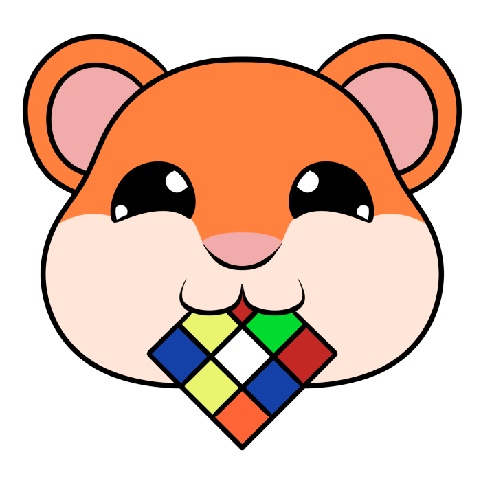

# Merkarubik



### **Ciclo Formativo de Grado Superior de Desarrollo de Aplicaciones Web (D.A.W.)**
### Centro Educativo : I.E.S. SUAREZ DE FIGUEROA


**Autor del proyecto** : Verónica Ramírez Figueredo

**Tutor del proyecto** : Miguel Ángel Domínguez Espino

**Fecha de presentación** : Junio 2024

**Repositorio del proyecto**: [Github - vrfigueredo](https://github.com/suarezfigueroa/2324_TFG_VeronicaFigueredo)

<hr>

# Índice 

1. [Introducción del proyecto](#introducción)
    - [Objetivos](#objetivos)
    - [Justificación del proyecto](#justificación-del-proyecto)
        - [Análisis de mercado](#análisis-de-mercado)
        - [Vinculación de contenidos vistos en el ciclo formativo](#vinculación-de-contenidos-vistos-en-el-ciclo-formativo)
2. [Recursos Utilizados](#2--recursos-utilizados)
    - [Entornos de desarrollo](#entornos-de-desarrollo)
    - [Lenguajes de programación](#lenguajes-de-programación)
    - [Utilidades](#utilidades)
3. [Tecnologías de Desarrollo](#3--tecnologías-de-desarrollo)
4. [Diseño del proyecto](#4--diseño-del-proyecto)
    - [Diseño de la base de datos](#diseño-de-la-base-de-datos)
    - [Carga de datos inicial](#carga-de-datos-inicial)
    - [Roles de la aplicación](#roles-de-la-aplicación)
    - [Usuarios creados para pruebas](#usuarios-creados-para-pruebas)
5. [Lógica/codificación del proyecto](#5--lógicacodificación-del-proyecto)
    - [Principales procesos](#principales-procesos)
    - [Aspectos relevantes de la implementación](#aspectos-relevantes-de-la-implementación)
6. [Despliegue Web del proyecto](#6--despliegue-web-del-proyecto)
7. [Manual de usuario](#7--manual-de-usuario)
8. [Conclusiones y aspectos a mejorar](#8--conclusiones-y-aspectos-a-mejorar)
9. [Bibliografía](#bibliografía)
10. [Agradecimientos](#agradecimientos)

<hr>

## 1.- Introducción del proyecto

En este documento, se detallará la aplicación creada por Verónica Ramírez Figueredo como proyecto de TFG del curso DAW 2023/2024, tanto sus detalles de uso, como de creación y despliegue del mismo.

### Objetivos

Los objetivos del proyecto son desarrollar una aplicación web simulando una tienda online de cubos de rubik. 
- Los usuarios podrán registrarse y disponer de una cesta donde añadir los artículos, separados en secciones; así como modificar o borrar los artículos en la cesta antes de ser ejecutada la compra. 

- Los usuarios dispondrán también de un registro de compras anteriores realizadas, con los productos detallados en cada registro. 

- Cada sección dispondrá de tarjetas representativas de cada producto, así como selectores de filtro. 

- Cada tarjeta llevará a una página explicativa del producto donde se podrá efectuar el añadido a la cesta así como la cantidad deseada del producto.

- Cada usuario tiene un registro de ventas previas, que podrá consultar en el modal bajo su nombre, donde se mostrarán sus compras realizadas anteriormente de forma detallada.

- En el pie de página se encuentran links a diferentes redes sociales, así como una imagen de la mascota de la compañía, que es un link a una página con detalles extras de la creación del proyecto.

### Justificación del proyecto

#### Análisis de mercado

El mercado de cubos de Rubik ha experimentado un gran auge en los últimos años, impulsado por una creciente comunidad de aficionados y competidores, así como del nacimiento de creadores de contenido dedicados al coleccionismo o competición de estos puzzles tridimensionales. El mercado online de cubos de Rubik ofrece oportunidades significativas, gracias a la disposición del producto proyectada a cualquier lugar del mundo; y actualmente es la forma preferida por los consumidores para la adquisición de nuevo material.

#### Vinculación de contenidos vistos en el ciclo formativo

Los conocimientos y habiliades adquiridos durante el ciclo formativo para la creación de este proyecto han sido los siguientes: 

-  **Lenguajes de programación**: 
        
    Los lenguajes de programación aprendidos durante el curso han sido los siguientes:

    - **Backend**: PHP, SQL.

    - **Frontend**: HTML, CSS, Javascript.

    - **Librerías y Frameworks**: JQuery, AJAX, Bootstrap, Sass.

- **Gestión de Bases de Datos**

    Los conocimientos adquiridos en el curso sobre bases de datos imprescindibles para la creación del proyecto:

    - **Diseño de Base de Datos**: Modelo ER, Diseño relacional, estructuras de tablas, relaciones entre campos de las mismas.

    - **Sentencias SQL**: Imprescindibles para las diferentes llamadas a la Base de Datos y la obtención, añadido, eliminación y modificación del contenido de las tablas.
    
## 2.- Recursos utilizados

### Entornos de desarrollo

Los entornos de desarrollo utilizados para la producción del proyecto han sido los siguientes: 

- **Visual Studio Code**: Editor de código fuente desarrollado por Microsoft. Gratuito y de código abierto, disponible tanto para Windows como para MacOS y Linux.

- **phpmyadmin**: Herramienta de software libre escrita en PHP, utilizada para el manejo y administración de la base de datos (MySQL) en interfaz web.

### Lenguajes de programación

Los diferentes lenguajes de programación utilizados para la creación de este proyecto han sido los siguientes:

- **HTML y CSS**: Utilizado para la estructura y diseño de la web. Utiliza librerías como Bootstrap para el diseño de los diferentes componentes del HTML; así como Sass para la edición más personalizada de los colores de la página.

- **Javascript**: Utilizado para el desarrollo en frontend y el dinamismo entre páginas, abarcando las funciones que aseguran el funcionamiento de la web.

- **PHP**: Utilizado para el desarrollo en backend, para la consulta a la parte de la base de datos desde las funciones en la parte cliente.

- **SQL**: Utilizado para la interacción con la base de datos y la obtención, inserción, modificación y eliminado de registros.

### Utilidades

Además de los entornos de desarrollo, se han utilizado diferentes herramientas:

- **Docker**: Software utilizado para crear un contenedor con la imagen del proyecto.

- **GitHub**: Utilizado para el control de versiones del código de la aplicación.

- **Cámara Nikon**: Las imágenes del carrousel y los diferentes fondos de las páginas, así como otras fotos de la web, han sido realizadas con una cámara personal de alta resolución.

- **Datos e imágenes**: Algunos de los datos para la estructura similar de tiendas online de cubos de rubik, e imágenes de tarjetas, así como datos de los productos actuales y precios, han sido obtenidas de las páginas [Kubekings](https://kubekings.com/cubos-de-rubik/?_gl=1*1dcz6eq*_up*MQ..*_ga*MTEwOTU2MDY0Ny4xNzE3MDUzNDcw*_ga_GB59DQEP5K*MTcxNzA1MzQ3MC4xLjEuMTcxNzA1MzQ3OS4wLjAuMA..&gclid=CjwKCAjwx-CyBhAqEiwAeOcTdV4i-s4JHBCT0f9IQ_a1CeDoauQ-GFMMqQLt3SYPgfboU6vv8NNwFRoCT9UQAvD_BwE) y [Mundos de Rubik](https://www.losmundosderubik.es/es/11-cubos).

## 3.- Tecnologías de Desarrollo

Las diferentes tecnologías utilizadas a lo largo del desarrollo del proyecto han sido las siguientes:

- **Frontend**: HTML, CSS, Javascript.

- **Backend**: PHP.

- **Base de datos**: MySQL.

## 4.- Diseño del proyecto

En este punto se indicará todo lo relacionado con el diseño del proyecto; tanto a nivel de Base de Datos, como de las interfaces.

### Diseño de la Base de datos

- `Diagrama E/R`:


- `Modelo Relacional`:


### Carga de datos inicial

La carga de datos incial insertará los datos base para iniciar el sistema; como usuarios, datos de cubos, datos de registros de ventas, datos de pedidos... 

Se realizará a través de un archivo .sql llamado **[mercarubik.sql](../mysql/merkarubik.sql)**.

### Diseño de la interfaz de usuario

El diseño de la interfaz de usuario es un aspecto crucial en el desarrollo del software, ya que impacta directamente en la experiencia del usuario. Se ha optado por un diseño sencillo y fácil de usar para que el usuario navegue por la aplicación de forma sencilla y concreta a la hora de buscar los productos adecuados a sus gustos.

### Roles de la aplicación

Éstos definen los diferentes niveles de acceso y privilegios que tienen los usuarios en el sistema.

A pesar de que existe en la base de datos un usuario que es el que realiza las llamadas a la base de datos, ya que se trata de una "tienda" el único rol disponible es el de usuario; ya que desde la aplicación en ningún momento se insertarán o eliminarán datos cruciales como en los productos o en los datos de los usuarios.

Todos los cambios importantes se realizarán desde dentro de la misma base de datos, vía **phpmyadmin**, como protección; por lo tanto no hay necesidad de crear un rol "administrador" en la aplicación.

### Usuarios creados para pruebas

Crear usuarios para pruebas de una aplicación es una práctica esencial para asegurar que la aplicación funcione correctamente en diversas situaciones.

Se crearon 4 usuarios creados para pruebas (con diferentes niveles de compras registradas para pruebas de visualización de registro):

- User: ``vero@email.com``. Password: ``Vero1234``
- User: ``osmel@email.com``. Password: ``Osmel1234``
- User: ``sergio@email.com``. Password: ``Sergio1234``
- User: ``agus@email.com``. Password: ``Agus1234``

A pesar de estos usuarios ya creados, usted puede crear su usuario propio con contraseña propia, y probar las diferentes funcionalidades de la web.

## 5.- Lógica/codificación del proyecto

La lógica y la codificación de un proyecto de software son fundamentales para el funcionamiento correcto y eficiente de la aplicación. A continuación, se presenta una descripción general de los componentes clave:

### Principales procesos

Se implementan varios procesos imprescindibles para el funcionamiento de la tienda online:

- **Registro de usuarios**: Para tener cuenta en la tienda, con el registro se crea un usuario y su cesta personal.

- **Autenticación**: Sólo los usuarios registrados podrán disponer de cesta donde añadir pedidos y posteriormente ejecutar compras.

- **Carga de tarjetas**: Según el tipo de cubo a buscar, se cargarán unas tarjetas obtenidas de la base de datos, pudiéndose ordenar y filtrar por categoría, base u orden a elegir.

- **Detalles de cubo**: Proceso por el cual se buscan los datos de un cubo en específico tras clicar en su tarjeta correspondiente, que permite el añadido a la cesta.

- **Cesta de compra**: Proceso donde se almacenan en base de datos los diferentes pedidos asociados a la cesta del usuario(cubo y cantidad).

- **Compra**: Este proceso ejecuta la compra de los pedidos en cesta. En la base de datos, los pedidos comprados se borrarán, tras crearse un registro de la venta.

- **Ver ventas**: Proceso que carga desde la base de datos los detalles de las compras anteriores realizadas por el usuario.

### Aspectos relevantes de la implementación

- **Validación de datos**: La validación de datos es un proceso crítico en el desarrollo de software para asegurar que los datos ingresados por los usuarios o recibidos de otras fuentes sean correctos y estén en el formato adecuado.
    - **Validación de Formularios**: En la parte de frontend, previo a enviarse, se validan los datos de los formularios: se comprueba que no estén vacíos, que mantengan el estándar deseado en cada input, y en casos concretos que no se repitan los datos en el campo específico de la base de datos.
    - **Validación en el servidor**: En la parte de backend, en todas las consultas se realizan acciones de protección de datos para evitar la manipulación de datos mediante inserción SQL y así garantizar la seguridad de los datos enviados a la base de datos.

- **Control de acceso**: La página web puede ser navegada en parte sin necesidad de autenticación, pero para realizar acciones como añadir pedidos, efectuar compras, y ver compras anteriores, es imprescindible **estar autenticado** con un usuario válido en la web. Sin ello, las acciones cruciales están desabilitadas.

- **Sistema de carpetas**: Organizar el sistema de carpetas de un proyecto es esencial para mantener un código limpio, manejable y fácil de navegar. A continuación se muestra un esquema de la organización de carpetas del proyecto:

```
2324_TFG_VeronicaFigueredo
├───app
│   ├───css
│   ├───cubos
│   ├───html
│   ├───img
│   ├───js
│   ├───node_modules
│   └───php
├───docker
│   ├───nginx
│   │   ├───config
│   │   └───snippets
│   └───php
├───DOCUMENTACION
│   ├───anexos
│   │   ├───anexo I
│   │   │   └───capturas
│   │   └───anexo II
│   │       └───capturas
│   └───images
└───mysql
```

- **app**: Contiene los archivos de la aplicación web.
    - **css**: Contiene los archivos de estilo, tanto como el css personal, como el de Sass modificado.
    - **cubos**: Carpeta que contiene las diferentes imágenes de las tarjetas de los cubos.
    - **html**: Contiene los archivos html extras al `index.html`.
    - **img**: Contiene las imagenes utilizadas en la web.
    - **js**: Contiene los archivos javascript (.js) que darán dinamismo y funcionalidad a la web.
    - **node_modules**: Carpeta contenedora del framework de Bootstrapt
    - **php**: Contiene los archivos de php que harán las funciones de backend hacia la base de datos.
- **docker**: Contiene los archivos de configuración necesarios para el despliegue de la web en un contenedor docker
    - **nginx**: Archivos de configuración para el funcionamiento del servicio web.
    - **php**: Archivo de creación para el servicio php.
- **DOCUMENTACIÓN**: Contiene los archivos de la documentación del proyecto, así como las imágenes utilizadas en el mismo.
    - **Anexos**: Donde se almacenarán los dos anexos a esta documentación.
        - **Anexo I**: Anexo para el despliegue web del proyecto. Contendrá la carpeta **capturas** para las imágenes utilizadas en el mismo.
        - **Anexo II**: Anexo para el manual de usuario. Contendrá la carpeta **capturas** para las imágenes utilizadas en el mismo.
- **mysql**: Almacena el archivo fuente de la base de datos `merkarubik.sql`.

## 6.- Despliegue Web del proyecto

En este apartado se indican los aspectos relevantes del proceso del despliegue de la aplicación, hosting utilizado, y pasos realizados para el completado del mismo. 

Link al anexo explicativo del despliegue: [Anexo I - Despliegue Web del proyecto](anexo%20I/README.md)

## 7.- Manual de usuario

En este apartado se despliega el manual de usuario de la aplicación, donde se incluyen los puntos principales del proyecto así como su uso.

Link al anexo explicativo del manual de usuario: [Anexo II - Manual de usuario](anexo%20II/README.md)

## 8.- Conclusiones y aspectos a mejorar

- **Conclusiones**: La creación de este proyecto ha permitido la prueba y puesta a punto de todos los conocimientos adquiridos a lo largo del curso, así como ha influenciado a la búsqueda externa de nuevas implementaciones a añadir en el proyecto. La colaboración con compañeros de clase ha sido crucial para el buen desarrollo del mismo; afianzando la confianza con otros programadores a la hora de compartir dudas y resoluciones de código de formas diversas que han influido en un crecimiento del conocimiento adquirido.

- **Aspectos a mejorar**: Debido al poco tiempo disponible fuera de las prácticas de FCT y su correspondiente aprendizaje extra, no se ha podido desarrollar el proyecto tanto como se planeaba en un inicio. Algunos puntos que me hubiera gustado mejorar son los siguientes:

    - **Más contenido**: El sector de cubos de rubik dispone de miles de artículos; pero por falta de tiempo sólo ha podido agregarse una cantidad justa para la prueba total de la página.

    - **Cifrado en contraseñas**: Tras errores que no se han podido solucionar a tiempo no se ha podido implementar un cifrado de contraseña como se tenía pensado hacer en un inicio.

    - **Más ejemplos de diseño**: Se han tratado todos los puntos vistos en el campo de diseño de interfaces web; aunque de haberse dispuesto de más tiempo se habría añadido un diseño más fino y corregido con mejor aspecto visual para el cliente.

    - **Edición de datos del usuario**: Para poder editar los datos del usuario una vez creado desde el entorno cliente.

## Bibliografía

Los recursos más importantes utilizados han sido los siguientes:

- **Bootstrap**: [Documentación Bootrstrap](https://getbootstrap.com/docs/5.3/getting-started/introduction/)

- **Docker**: [Documentación Docker](https://docs.docker.com/) 

- **Digital Oceans**: [Documentación Digital Oceans](https://docs.digitalocean.com/products/)

- **Despliegue Docker en Digital Ocean**: [Tutorial en Github](https://gist.github.com/pixeline/6d57e68aa6c1357b14c14fe8e3b4b963)

- **Preguntas sobre errores concretos del código**: [Herramienta ChatGPT]()

- **Fuente de imágenes y datos**: Algunas imágenes e información de los productos han sido obtenidas en:
    - **Kubekings**: [Enlace a la página](https://kubekings.com/)
    - **Los Mundos de Rubik**: [Enlace a la página](https://www.losmundosderubik.es/es/)
    - **Imgur**: [Enlace a la página](https://imgur.com/)

## Agradecimientos

En primer lugar, agradecer a los profesores Miguel Ángel, Jesús, Juan, José y Antonio por su labor en la enseñanza y dedicación al conocimiento del desarrollo de aplicaciones web.

Y también agradecimientos a Sergio Holguera, Agustín Ramírez y Osmel Navarro, por su dedicación y ayuda para con el proyecto incluso estando tan apurados de tiempo como lo he estado yo, resolviéndome dudas y aconsejando sobre mejoras en el código y el diseño.

Gracias por todo ❤️