# Merkarubik - Despliegue Web del Proyecto

**Autor del proyecto** : Verónica Ramírez Figueredo

**Repositorio del proyecto**: [Github - vrfigueredo](https://github.com/suarezfigueroa/2324_TFG_VeronicaFigueredo)

<hr>

## Índice 

1. [Introducción](#1--introducción)
    - [Requisitos Hardware](#requisitos-hardware)
    - [Servidores utilizados](#servidores-utilizados)
2. [Paso 1 - Docker]()
    - [2.1 - Estructura de carpetas](#21---estructura-de-carpetas)
    - [2.2 - Archivos de configuración](#22---archivos-de-configuración)
    - [2.3 - Crear el contenedor](#23---crear-el-contenedor)
    - [2.4 - Probar el contenedor](#24---probar-el-contenedor)
3. [Paso 2 - Digital Ocean](#3--paso-2-digital-ocean)
    - [Crear Droplet con Docker](#crear-droplet-de-docker)
4. [Paso 3 - Enlazar Github a Droplet](#4--enlazar-github-a-droplet)
<hr>

## 1.- Introducción

En este anexo se van a indicar los aspectos relevantes del proceso del despliegue de la aplicación, hosting utilizado, y pasos realizados para el completado del mismo.

### Requisitos hardware

Los requisitos hardware estipulados para un proyecto de este calibre son los siguientes

- **CPU:** Procesador de 2 núcleos mínimo.

- **RAM:** 4 GB de memoria RAM (mínimo); 8 GB (recomendado).

- **Almacenamiento:** Mínimo 50 GB de espacio en disco.

- **Conectividad:** Conexión de red de alta velocidad.

### Servidores utilizados

Los servidores utilizados para el despliegue de la aplicación son:

- **Servidor web**: `nginx`
- **Servidor de Base de datos**: `MySQL`
- **Administración de Base de Datos**: `phpmyadmin`

## 2.- Paso 1: Docker

Para desplegar este proyecto, se decidió hacer un contenedor Docker que posteriormente se subiría a un Droplet de Docker en Digital Ocean. Se utilizará **Docker**, **Docker Desktop** y **Visual Studio Code** para la realización del mismo.

### 2.1 - Estructura de carpetas

La estructura de carpetas que utilizaremos para nuestro contenedor de docker será la siguiente:

```
├───app
├───docker
│   ├───nginx
│   │   ├───config
│   │   │   └────default.conf
│   │   └───snippets
│   │       └────fastcgi-php.conf
│   └───php
│       └────dockerfile
├───mysql
│   └───merkarubik.sql
└───docker-compose.yml
```

Algunos puntos a tener en cuenta de esta estructura:
- `app` guarda todos los archivos y carpetas de la aplicación.
- `docker/nginx/config` guarda el archivo `default.conf`
- `docker/php` almacenará el archivo `dockerfile`
- `mysql` guarda el código de la base de datos `merkarubik.sql` 
- En la raíz se guardará el archivo `docker-compose.yml`

### 2.2 - Archivos de configuración

Docker utiliza varios archivos de configuración para definir y gestionar contenedores, servicios y redes. Los principales archivos de configuración son `dockerfile`, `docker-compose.yml`, y en el caso de la configuración de nginx, `default.conf`.

- **dockerfile** : `dockerfile` es un archivo de configuración que contiene instrucciones paso a paso sobre cómo construir una imagen de Docker. En este caso, el archivo quedaría de esta forma:

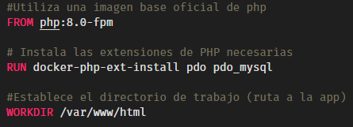

- **docker-compose.yml** : `docker-compose.yml` se utiliza para definir y ejecutar aplicaciones multicontenedor. Facilita la orquestación de múltiples servicios de Docker, con más especificaciones de configuración que utilizando un dockerfile simplemente. En él se configurarán los servicios web, php, db y phpmyadmin, sus puertos, volúmenes, dependencias y networks; así como los volúmenes y networks de la imagen del contenedor. En este caso, el archivo quedaría así:

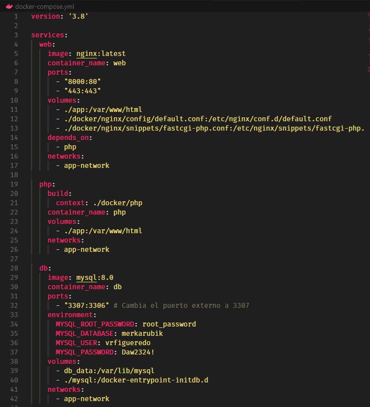


Explicación del código del `docker-compose.yml`:

    - `version`: Especifica la versión de Docker Compose que se usa.
    - `services`: Define los servicios que compondrán el contenedor.
    - `image`: Imagen que se usará para la construcción del servicio.
    - `container_name`: Nombre del contenedor (opcional)
    - `ports`: Puertos que se exponen (contenedor:local)
    - `volumes`: Volúmenes a utilizarse (directorio actual:directorio contenedor)
    - `network`: Define cómo se comunican los servicios entre sí. 

- **default.conf** : El archivo `default.conf` se utiliza comúnmente como un archivo de configuración para Nginx, especialmente en el contexto de Docker. Este archivo define la configuración del servidor web y cómo manejar las solicitudes HTTP. Específicamente, `default.conf` puede configurar aspectos como la escucha de puertos, las ubicaciones de los recursos, los proxies a otros servicios, y las directivas de seguridad. El archivo quedaría de la siguiente manera:
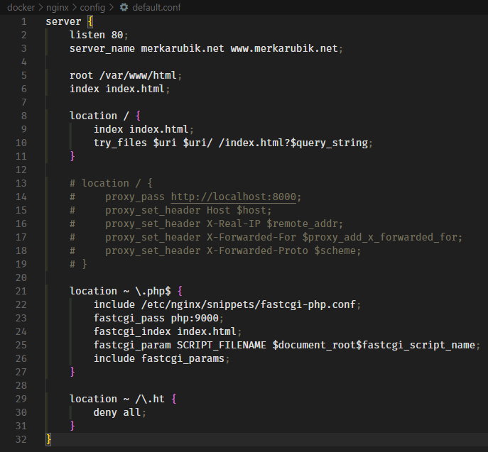
    - `listen` : Escucha por el puerto 80.
    - `server_name` : Especifica el nombre del servidor. 
    - `root` : Directorio raíz de los archivos de la app.
    - `index` : Establece **index.html** como archivo índice.
    - `location /` : Bloque de localización de la ruta global.
    - `try_files` : Trata de servir el archivo. Si no lo encuentra, redirige a `index.html`.
    - `location ~ \.php$` : Bloque de localización para php.
    - `location ~ /\.ht` : Bloque de localización para archivos "ht"
    - `deny all` : Deniega el acceso, en este caso a los archivos ".ht"

### 2.3 - Crear el contenedor

Una vez tengamos la configuración hecha, es hora de levantar el contenedor. Para ello, abriremos una consola de comandos y escribiremos:

        docker compose up

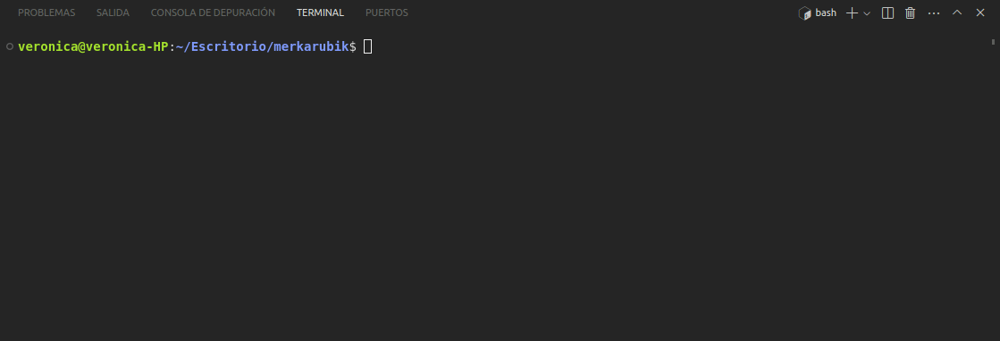

Así se construirá y levantará el contenedor. Si hacemos el comando añadiendo `-d` (modo "detached"), dejará la consola disponible para seguir con su uso.

### 2.4 - Probar el contenedor

Una vez está levantado el contenedor, lo único que tenemos que hacer es acceder a `localhost:8000` en nuestro navegador. Si todo ha salido bien, se nos cargará la página web de nuestro contenedor docker.

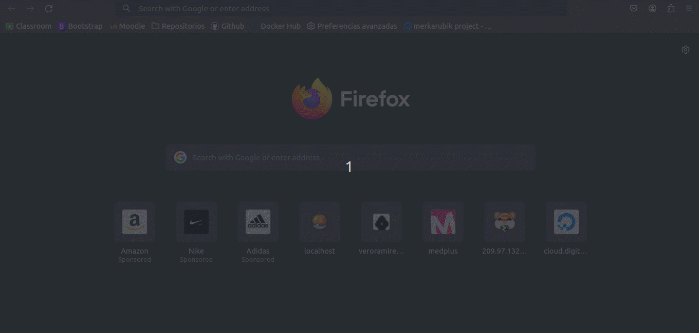

## 3.- Paso 2: Digital Ocean

El siguiente paso será desplegar nuestro Docker en **Digital Ocean**.

"Digital Ocean" es una plataforma de servicios en la nube diseñada para simplificar la implementación y el escalado de aplicaciones que se ejecutan simultáneamente en múltiples ordenadores.

### Crear Droplet de Docker

Un Droplet es una instancia de servidor virtual privado (VPS) que se ejecuta en la nube. Los Droplets son los componentes básicos de la infraestructura de DigitalOcean y se utilizan para alojar aplicaciones, sitios web, bases de datos y otros servicios que necesitan una plataforma de computación en la nube. Cada Droplet es una máquina virtual completamente aislada con su propio sistema operativo, recursos de CPU, memoria RAM, almacenamiento y red. En este caso, nosotros necesitaremos un Droplet de Docker.

Iniciaremos sesión en Digital Ocean. En nuestro menú, buscaremos el botón verde "Create", y ahí, a la derecha, "Create Droplet" en azul.


Elegiremos la región más cercana a nuestra ubicación (para mejorar el tiempo de respuesta), y elegiremos el sistema operativo. Para nuestro proyecto, vamos a elegir en "Marketplace" la imagen de Docker.


Configuraremos el hardware que va a soportar el droplet, dependiendo del presupuesto que queramos utilizar.

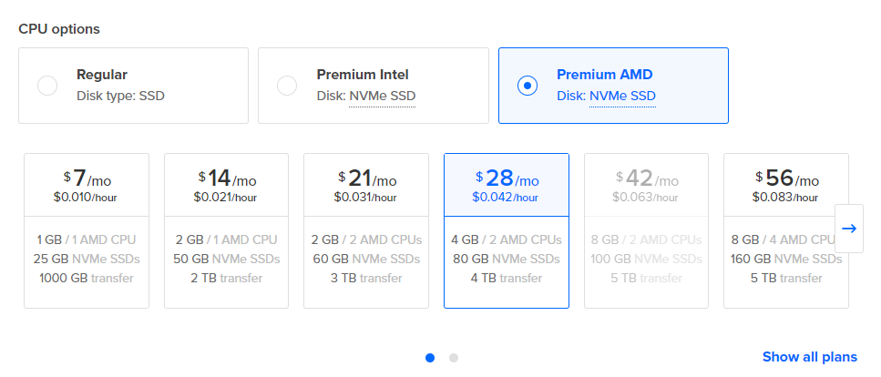

Ahora necesitamos adherirle una clave ssh al droplet. En caso de que no tengamos una clave ssh creada en nuestro ordenador, recomiendo ver [este tutorial para crear una clave ssh](https://git-scm.com/book/es/v2/Git-en-el-Servidor-Generando-tu-clave-p%C3%BAblica-SSH)

Una vez creada la clave, copiaremos el contenido de la `clavesshcreada.pub` y lo añadiremos al Docker en **"New SSH Key"**. Una vez añadida, la asignaremos.

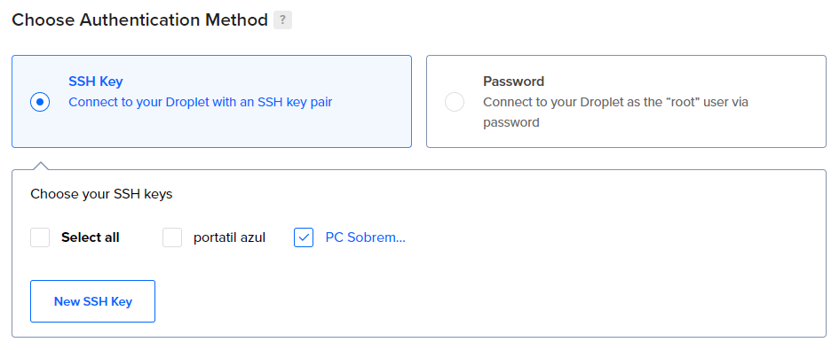

Elige un nombre para indentificar el droplet de Docker, y lo asignas a un proyecto. Una vez hecho, pulsamos sobre "Create Droplet", y ya tendríamos nuestro Droplet con Docker creado.

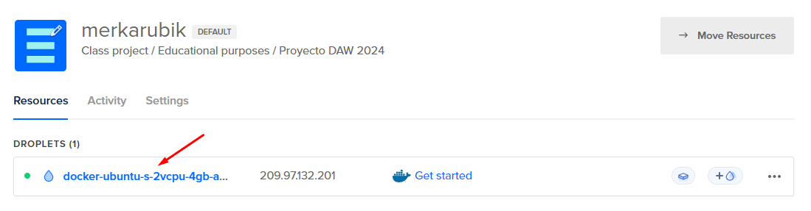

## 4.- Enlazar Github a Droplet

El último paso es conseguir enlazar nuestro docker a un repositorio en Github, y éste, que se clone en el repositorio del Droplet; así podremos manejarlo con mucha más facilidad.

El primer paso es crear un repositorio que contenga los archivos del docker que hemos creado con nuestra aplicación. Una vez lo tengamos, vamos a clonar nuestra repositorio en nuestro ordenador (clonarlo en el pc no es obligatorio, pero es altamente recomendable si queremos hacer las ediciones en local antes de subir los cambios al repositorio en github)

Vamos a clonarlo mediante la clave ssh:

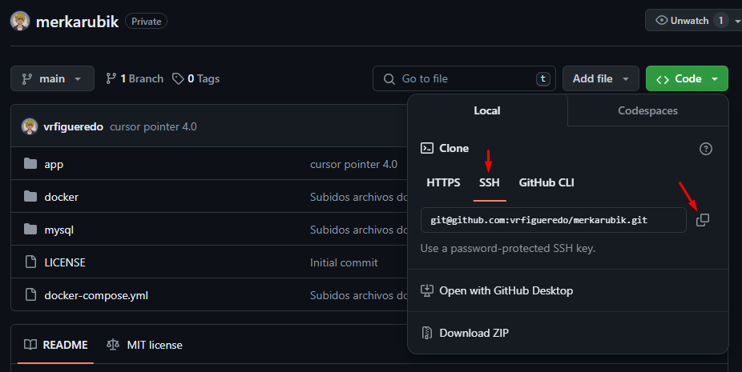

En nuestro terminal en local, en la carpeta que queramos clonarlo, usaremos el comando `git clone git@urldelrepo`

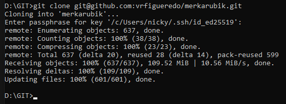

Una vez lo tenemos en local, nos vamos a centrar en el droplet. Al igual que tenemos clave ssh en github de nuestro ordenador, vamos a crear una clave ssh en el droplet que irá unida al github también. 

Primero, vamos a conectarnos a la terminal del droplet. En la ventana de nuestro Digital Ocean veremos una ip en el droplet; es a esa ip a la que nos debemos conectar.

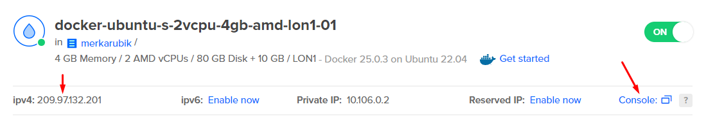

Si clicamos en "Console", nos abrirá una consola, conectada al droplet directamente (si no, podemos hacer en nuestra consola local `ssh root@ipdeldocker` para conectarnos también)

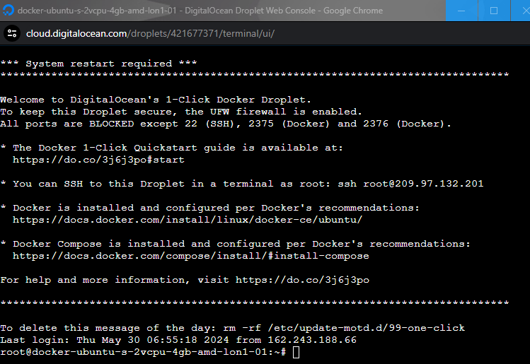

Una vez dentro, creamos la clave ssh del droplet:

        ssh-keygen -t rsa -N "" -f /root/.ssh/id_rsa

Ya creada, copiamos el contenido de la clave pública

        cat /root/.ssh/id_rsa.pub

Ahora, vamos a Github. En el apartado Settings, buscamos en el menú de la derecha "SSH and GPG keys", y ahí introducimos nuestra nueva clave ssh.


Una vez añadida la clave ssh, es hora de clonar el repositorio en nuestro droplet. Usamos el mismo comando que usamos para clonarlo en nuestro ordenador local; pero esta vez dentro de la consola del droplet.

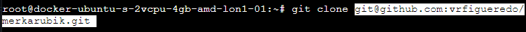

Esto nos clonará el repositorio de github dentro del droplet. Una vez dentro sólo tenemos que acceder a la raíz donde está el `docker-compose.yml`, y levantar el contenedor.

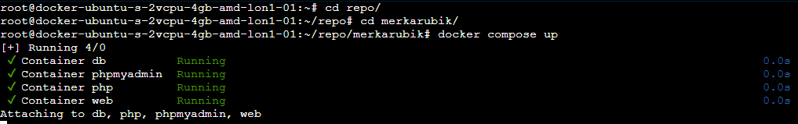

Y, si todo ha ido bien, ahora nuestro contenedor estará desplegado en la red. Si accedemos a la ip con el puerto, deberíamos ver nuestra página desplegada correctamente.


Ya tendríamos nuestra página online y funcionando 💜 ¡Bienvenido a Merkarubik!