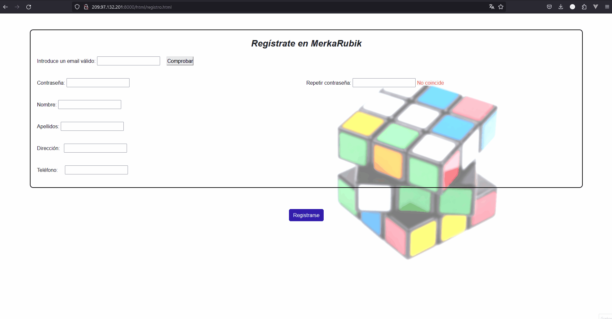
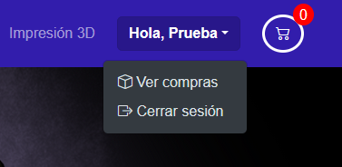
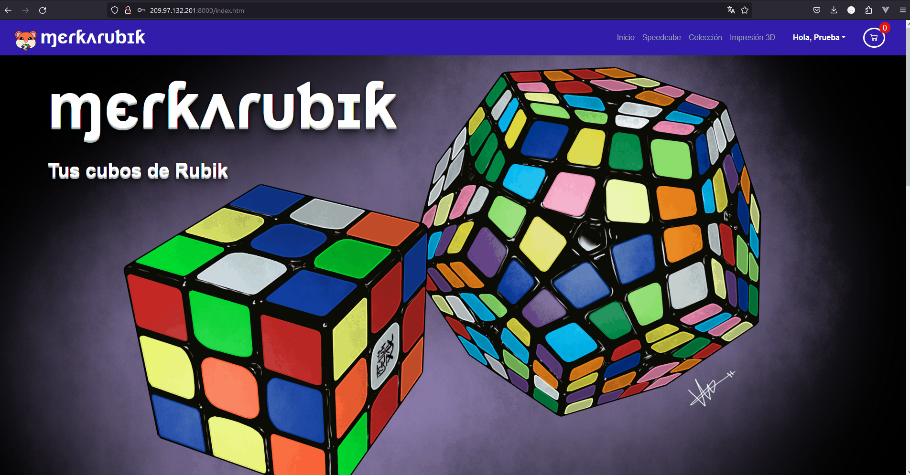
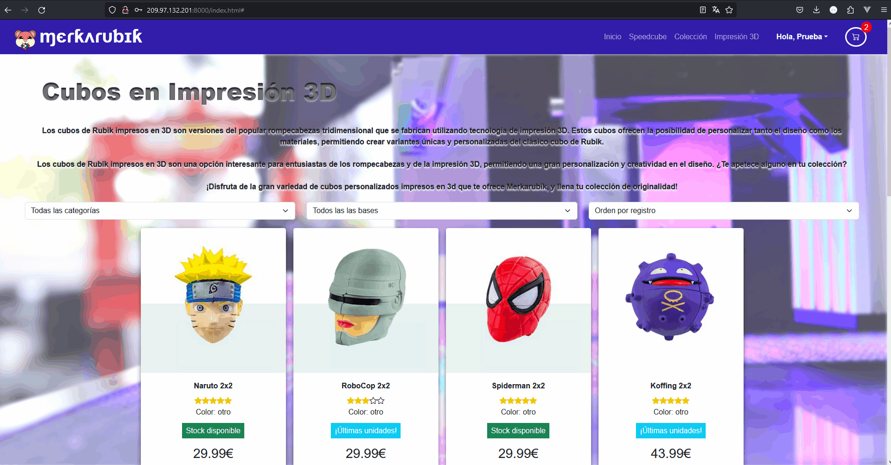

# Merkarubik - Manual de usuario

**Autor del proyecto** : Verónica Ramírez Figueredo

**Repositorio del proyecto**: [Github - vrfigueredo](https://github.com/suarezfigueroa/2324_TFG_VeronicaFigueredo)

## Índice 

1. [Introducción](#1--introducción)
2. [Página inicial](#página-inicial)
3. [Registro de nuevo usuario](#registro-de-nuevo-usuario)
4. [Iniciar sesión](#iniciar-sesión)
5. [Navegando entre páginas](#navegando-entre-páginas)
6. [Añadir un producto a la cesta](#añadir-un-producto-a-la-cesta)
7. [Modificado o borrado de un pedido](#modificado-o-borrado-de-un-pedido)
8. [Comprar](#comprar)
9. [Links extra](#links-extra)

## Introducción

¿Buscas desafiar tu mente y mejorar tus habilidades cognitivas? ¡Has llegado al lugar adecuado! Los cubos de Rubik son más que un simple pasatiempo; son una herramienta educativa que promueve el pensamiento lógico, la resolución de problemas y la creatividad.

MerkaRubik está aquí para ayudarte a encontrar el cubo perfecto para ti, ya sea que estés buscando el clásico cubo 3x3, los desafiantes cubos de velocidad, o incluso modelos especiales y coleccionables. Y todo listo para cualquier bolsillo; ¡bajo precio y alta calidad!

### ¿Qué es este manual?

Este documento está diseñado para guiarte a través de las diversas funcionalidades y características de la página web, asegurando que puedas navegar y utilizar todas las herramientas disponibles de manera eficiente y efectiva.

### Objetivos del manual

El objetivo principal de este manual es proporcionar una guía completa y detallada que facilite el uso de nuestra página web. Aquí encontrarás instrucciones paso a paso, capturas de pantalla, y consejos útiles para aprovechar al máximo todas las funcionalidades del sitio.

## Página inicial

Cuando entras en [Merkarubik](http://209.97.132.201:8000/), lo primero que encuentras es una pantalla de bienvenida. Nos encontramos una`barra de navegación` con las diferentes opciones a elegir, una gran imagen de bienvenida de nuestra marca. 

Si haces scroll hacia abajo, verás un carrousel interactivo con las diferentes secciones que puedes visitar. También encontraremos una hermosa foto con una pequeña descripción inicial de nuestra tienda.

Por último, veremos un footer, presidido por nuestra simpática mascota **Aníbal** el hamster cubero. En este footer, encontraremos links a las diferentes redes sociales de la programadora.

En la barra de navegación superior, encontraremos diferentes secciones. Pero antes de empezar a navegar por la página, vamos a iniciar sesión; en caso de que no nos hayamos registrado nunca, nos registraremos primero

## Registro de nuevo usuario

Para registrarnos como usuario, vamos a hacer clic en la parte superior derecha de la pantalla, en **Iniciar Sesión**. Se nos abrirá un modal para poder iniciar sesión con nuestros datos. Si no tenemos cuenta, en la parte de abajo del modal clicaremos sobre **¡Regístrate en Merkarubik!**. Esto nos llevará a la página de registros.

Una vez dentro de la página, vamos a rellenar los datos de nuestra nueva cuenta. Nos saldrán varios campos a rellenar:

- **Introduce un email válido**: Sólo puede haber una cuenta por correo electrónico. Cuando introduzcas el email, pulsa el botón `Comprobar`. Te dirá si el correo es inválido (si has escrito algo que no sea un correo electrónico válido o si el campo está vacío); si está en uso (que significa que ya hay una cuenta con ese correo asociado), o si por el contrario es válido. Para este ejemplo, usaremos `prueba@email.com`

- **Contraseña**: Deberás introducir una contraseña nueva para tu cuenta. Para esta prueba, usaremos `Prueba1234`

- **Repetir contraseña**: Has de repetir la misma contraseña en este campo de nuevo. Cuando hayas escrito correctamente, el campo "No coincide" pasará a indicarte con un tic verde que lo has hecho bien.

- **Nombre**: Introduce tu nombre. No puedes dejar el campo vacío.

- **Apellidos**: Introduce tus apellidos. No puedes dejar el campo vacío.

- **Dirección**: Introduce tu dirección de envío. No puedes dejar el campo vacío.

- **Teléfono**: Introduce tu teléfono. No puedes dejar el campo vacío.

Si has introducido todo bien, al clicar el botón `Registrarse` te creará tu nuevo usuario, y volverás a la página de inicio. (Si has hecho algo mal, saltará una alerta por pantalla para que corrijas tus fallos).

Ya tenemos nuestra cuenta para navegar por Merkarubik.

## Iniciar sesión

Para poder iniciar sesión con nuestra nueva cuenta, volvemos a, en la página inicial, clicar sobre **Iniciar Sesión** en la parte superior derecha. Se nos abrirá nuevamente el modal para inciar sesión; esta vez, rellenaremos con los nuevos datos que hemos creado.

Como puedes comprobar, si intentas iniciar sesión con una cuenta que no existe o con una contraseña inválida, saltará una alerta de error, y tendrás que introducirlo nuevamente.

Si accedemos satisfactoriamente, veremos que en lugar de **Iniciar sesión** ahora nos sale un menú saludándonos con nuestro nombre, y junto a éste, un botón de cesta. Como somos nuevos y aún no hemos añadido ningún producto a nuestra cesta, saldrá con un "0" sobre la misma.

## Menús de usuario y de cesta

Ahora tenemos disponibles dos modales (menús). Si pulsamos en nuestro nombre, nos saldrá un desplegable con dos opciones:

### Menú usuario

- **Ver compras**: Esta opción nos dirigirá a una página donde podremos ver un registro de todas nuestras compras. Como aún no hemos realizado compras, nuestra página de compras estará vacía.

- **Cerrar sesión**: Si pulsamos esta opción, nos desloguearemos de la página.

### Menú cesta

Si pulsamos en el icono del carrito, entraremos en nuestra cesta. En este modal se van a cargar todos los pedidos que vayamos almacenando para nuestra primera compra. Aquí podremos posteriormente modificar los pedidos que queramos comprar, revisar la cantidad de productos, el precio, y si estamos de acuerdo, efectuar finalmente la compra. Por el momento, como es la primera vez que entramos, estará vacío.

## Navegando entre páginas

Vamos a ver nuestros productos. Tanto si clicamos en las opciones del menú de la barra de navegación superior, como si clicamos sobre las fotos del carrusel de fotos, podremos acceder a las diferentes páginas que ofrece nuestra tienda. Hay un selecto grupo de opciones a elegir:

- **Speedcube**: La categoría de Speedcube en nuestra página web está diseñada para entusiastas del cubo de Rubik y aquellos que buscan mejorar sus habilidades de resolución rápida. Aquí encontrarás una amplia gama de productos relacionados con el speedcubing.

- **Colección**: La categoría de Coleccionismo en nuestra página web está diseñada para entusiastas y coleccionistas que buscan puzzles únicos y de valor. Aquí encontrarás una amplia gama de productos, de toda forma, clase y tipo, relacionados con el coleccionismo de cubos de Rubik.

- **Impresión 3D**: La categoría de Impresión 3D en nuestra página web está diseñada para entusiastas, profesionales y aficionados de la tecnología de impresión tridimensional, ofreciendo los últimos modelos creados por los mejores diseñadores para añadir a tu arsenal cubístico. Aquí encontrarás una amplia gama de productos relacionados con la impresión 3D.

Cada una de nuestras secciones está precedida por una pequeña descripción del tipo de puzzle que buscas, seguido por una amplia selección de productos. Los cubos de nuestra tienda se mostrarán en pantalla en una sucesión de tarjetas informativas; estas tarjetas disponen de 3 selectores sobre ellas para filtrar el contenido según lo que necesites buscar. Cada una de estas tarjetas lleva al contenido en detalle de su producto.

## Añadir un producto a la cesta

Vamos a añadir nuestro primer producto a la cesta. Para ello, vamos a navegar por la página, y clicamos en el cubo que nos gustaría comprar. Cuando pinchemos en la tarjeta, se nos abrirá una página con los detalles del cubo que queremos comprar; con su imagen más grande, su descripción, nombre, precio y, si está disponible, su botón de compra.

Podemos elegir la cantidad de cubos que queramos comprar de este modelo (Tranquilo; el selector de cantidad nunca sobrepasará la cantidad disponible de stock del producto). Una vez elijamos la cantidad que queramos (por defecto 1), podemos pulsar el botón "Añadir a la cesta". Se nos mostrará como en nuestra cesta, antes vacía, ahora aparece el producto que acabamos de añadir. 

En el modal de la cesta veremos ahora los productos actuales.

## Modificado o borrado de un pedido

Podemos añadir nuevos pedidos a la cesta; pero también podemos modificar uno que ya está hecho. Vamos a crear la situación en la que añadimos un pedido nuevo; pero queremos comprar 2 unidades en vez de 1 después de haberlo añadido. Aquí te muestro cómo se puede hacer sin problema. Simplemente, ve a la tarjeta del cubo nuevamente, elige la nueva cantidad de ese modelo de cubo, y cuando le des a "Añadir a la cesta", verás que ahora sale con la nueva cantidad.

Como podemos comprobar en la siguiente captura, en la cesta se nos muestran los pedidos almacenados; la cantidad de cada cubo, el precio individual, y el precio total de cada uno de los pedidos. Debajo de éstos, los impuestos, y el precio total con el impuesto del 21% añadido, así como el botón `COMPRAR`.

Supongamos que no queremos comprar el `Hunter Pillow 2x4x6`. En la cesta, junto a cada pedido, aparece un botón con un icono de papelera. Si clicamos en el botón, borraremos el pedido asociado a esta fila de nuestro carrito, y el precio total se actualizará.

## Comprar

Vamos a añadir dos productos más a la cesta, y vamos a efectuar la compra.
Dentro del menú del carrito, en la parte inferior tenemos el botón `COMPRAR`. Cuando cliquemos, nos saldrá por pantalla un mensaje que nos indica que hemos efectuado la compra. Si vamos a nuestro menú superior de usuario, y hacemos clic en `Ver compras`, podemos ver que ahora tenemos ya un registro de la compra que hemos hecho; donde se muestra la fecha de la compra, los productos de los diferentes pedidos, y el total gastado.

Así mismo, como ya hemos comprado estos pedidos, la cesta se vaciará, lista para una nueva compra.

## Links extra

Como último detalle, si bajas a la parte inferior de la página, en el footer, encontrarás varios links a diversas redes sociales de la programadora. Si clicas sobre ellos, te llevarán a sus páginas web.

        Los links están custodiados por nuestro hermoso Aníbal, allá abajo en el footer... Si pasas el ratón por encima, éste se vuelve puntero. ¿Será que pueda clicarse también?

### Muchas gracias por seguir este manual de usuario. Espero que haya aclarado todas tus dudas sobre el manejo  te guste nuestra página y que disfrutes navegando por nuestra tienda sencilla pero hecha con amor.

### ¡A resolver! 💜